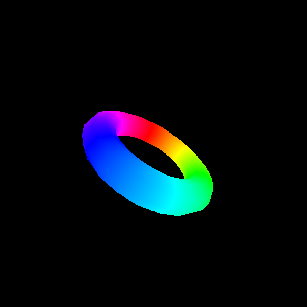

# 3D Software Rasterizer

A from-scratch implementation of a software rasterizer demonstrating core computer graphics algorithms.



## Features

- **Sutherland-Hodgman Polygon Clipping** - Clips polygons against the normalized device coordinate (NDC) view volume
- **DDA Line Rasterization** - Efficient wireframe rendering using the Digital Differential Analyzer algorithm
- **Barycentric Fill Rasterization** - Filled triangle rendering with proper depth interpolation
- **Z-Buffer** - Correct handling of overlapping geometry with depth testing
- **PLY File Support** - Load 3D models in ASCII PLY format

## Installation

```bash
# Clone the repository
git clone https://github.com/yourusername/rasterizer.git
cd rasterizer

# Install dependencies
pip install -r requirements.txt
```

## Usage

### Command Line

```bash
# Wireframe rendering
python main.py --model data/star.ply --mode line

# Solid rendering
python main.py --model data/torus.ply --mode fill --output torus.png

# Custom resolution
python main.py --model data/star.ply --mode fill --width 800 --height 800
```

### As a Library

```python
from src.ply_loader import load_ply
from src.clipping import clip_mesh
from src.rasterizer import rasterize
from src.framebuffer import Framebuffer

# Load model
mesh = load_ply("data/star.ply")

# Clip against view volume
clipped = clip_mesh(mesh)

# Transform to screen space
clipped.homogenize()
clipped.to_screen_space(600, 600)

# Rasterize
fb = Framebuffer(600, 600)
rasterize(clipped, fb, mode='fill')

# Get result
image = fb.to_image()
```

## Project Structure

```
rasterizer/
├── src/
│   ├── __init__.py       # Package exports
│   ├── mesh.py           # Mesh, Face, Vertex classes
│   ├── framebuffer.py    # Framebuffer with Z-buffer
│   ├── clipping.py       # Sutherland-Hodgman clipping
│   ├── rasterizer.py     # Line & fill rasterization
│   ├── ply_loader.py     # PLY file parser
│   └── transforms.py     # MVP matrix utilities
├── data/                 # Sample 3D models (.ply)
├── examples/             # Example output images
├── main.py               # CLI entry point
├── requirements.txt
└── README.md
```

## Algorithms

### Sutherland-Hodgman Clipping

The clipping algorithm processes each polygon against six planes defining the NDC cube `[-1, 1]³`. For each edge:
1. If the current vertex is inside and the previous was outside: add intersection point, then current vertex
2. If the current vertex is inside and the previous was inside: add current vertex
3. If the current vertex is outside and the previous was inside: add intersection point
4. If both are outside: add nothing

### DDA Line Rasterization

The Digital Differential Analyzer algorithm:
1. Calculate `steps = max(|Δx|, |Δy|)`
2. Compute increments: `x_inc = Δx/steps`, `y_inc = Δy/steps`
3. Iterate and plot rounded coordinates while interpolating color and depth

### Barycentric Fill Rasterization

Triangle filling using barycentric coordinates:
1. Compute bounding box of triangle
2. For each pixel in bounding box:
   - Calculate barycentric coordinates (α, β, γ) using edge functions
   - If all coordinates ≥ 0, pixel is inside
   - Interpolate depth and color: `value = α·v₁ + β·v₂ + γ·v₃`
   - Apply Z-test and set pixel

## Sample Models

The `data/` directory contains sample PLY models:
- `star.ply` - Simple star shape
- `torus.ply` - 3D torus
- `text.ply` - 3D text geometry
- `plane.ply` - Flat plane

## Requirements

- Python 3.8+
- NumPy
- Pillow (PIL)

## License

MIT License
